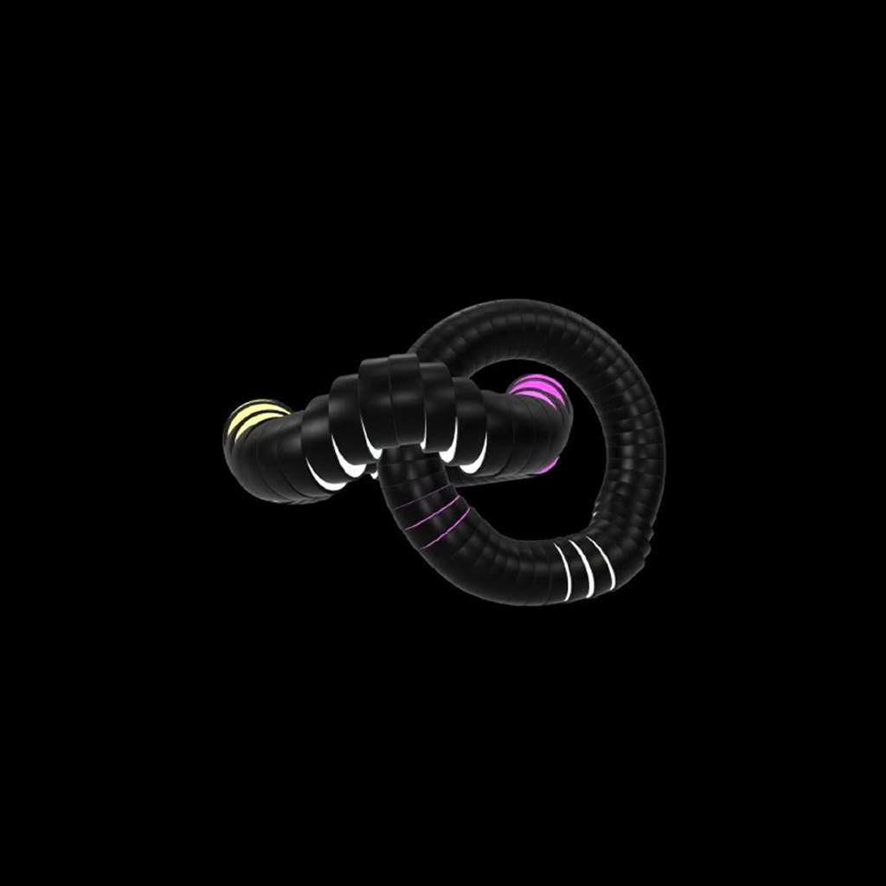

# Studio 10200

  

### Workshop

Welcome to **The Mothership**. This repo houses the central hub for Studio 10200, serving as both a portfolio and the orchestrator for various gaming and utility sub-projects.

## Key Features
- **Immersive 3D Experience**: Integrated Google `<model-viewer>` for real-time 3D hero elements.
- **Dynamic Feedback System**: A custom-built feedback interface powered by Supabase.
- **Privacy-First Analytics**: Lightweight user interaction tracking without invasive cookies.
- **Minimal UI**: Clean design language with custom-tuned animations.
- **CI/CD Driven**: Automated deployment via GitHub Actions

## Tech Stack
- **Frontend**: Flutter Web (Stable)
- **Backend**: Supabase (Database, Auth, Edge Functions)
- **Infrastructure**: GitHub Pages & Cloudflare DNS
- **Design**: Flutter Custom Painters & Vanilla CSS

## Project Registry
The Mothership currently orchestrates the following sub-deployments:
- **[Artikel Vogel](https://studio10200.dev/artikel-vogel/)**
- **[Hangmensch](https://studio10200.dev/hangmensch/)**
- **[Wördle](https://studio10200.dev/wordle/)**
- **[Tic Tac Zwö](https://github.com/3llips3s/tic-tac-zwo/releases/latest/download/tic_tac_zwo.apk)**

## License
This project is licensed under the [MIT License](LICENSE).

---
© 2026 Studio 10200. All rights reserved.
